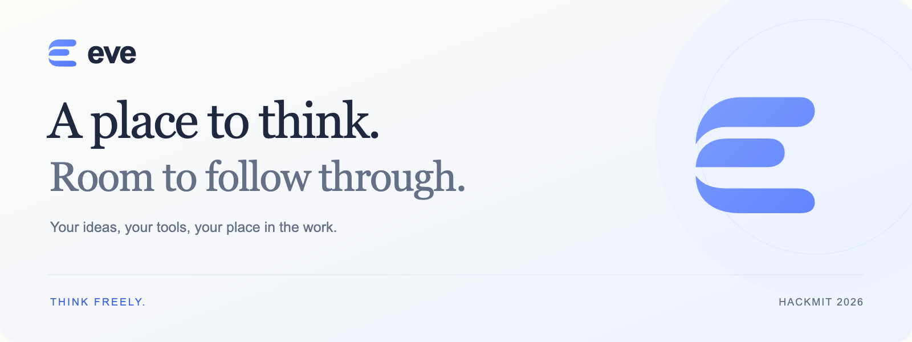
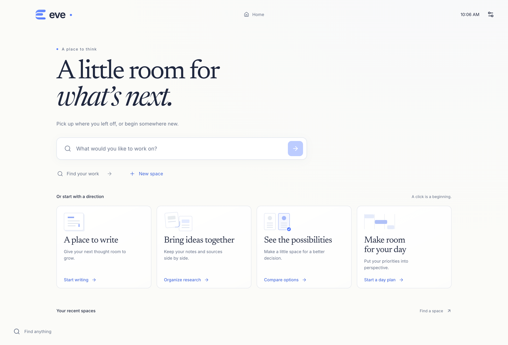
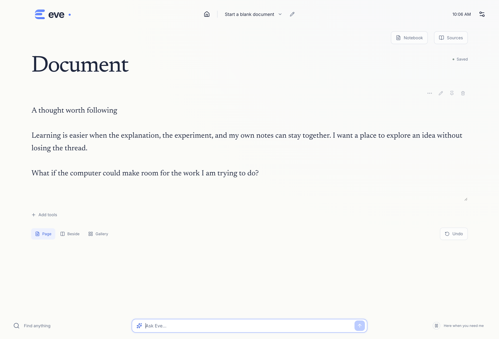

  

  <strong>An adaptive desktop for the work you mean to do.</strong> 
  Built for HackMIT 2026

## Start with an intention

Writing, learning, planning and building often mean moving between tools—and rebuilding your context each time. **Eve keeps your purpose, your material and your place in the work together.** Describe what you want to do, shape an editable workspace around it, and return without starting over.

A workspace can hold writing, checklists, tables, charts, a day plan, images, sources, a timer or a small design. AI can bring those tools together and help you shape your work. You can also begin with a blank page and work directly.

*Pick up where you left off, or begin somewhere new.*

## Room to follow through

**Begin in your own words.** Open a writing space immediately, or describe what you want to work on. Add the tools you need as your idea develops.

**Shape the work together.** Edit a sentence, organize a checklist, explore a table or ask Eve for a change. Review proposed edits, keep what helps and undo what doesn't.

**Keep your place.** Move between spaces without rebuilding your context. Notes and material stay with the work, and open code editors retain unsaved changes across navigation.

*A quiet writing space with sample text. Your words stay editable.*

## From an idea to something that works

Eve includes **Orbit**, a study timer you can make your own. Adjust its color and motion, explore the source in the integrated code editor, and see the preview respond. Return to your notes, then come back to the same editing session.

The same workspace can support a reading afternoon, a comparison of ideas or your next piece of writing.

## Built around your work

Eve uses Electron, React and TypeScript, with SQLite for local persistence and code-server for the embedded editor. AI arranges a registered set of tools through validated operations. Changes are checked against the current work before they are applied, and imported originals are preserved.

[How Eve works](docs/ARCHITECTURE.md) · [Credits](docs/CREDITS.md)

Eve is a desktop prototype demonstrated on Apple Silicon macOS and the ASUS GX10. AI assistance depends on a connected provider; writing, direct tools and saved spaces work independently. Voice, video playback and a standalone Linux desktop session remain experimental.

---

Created by [Kieran Schmitt](https://github.com/KieranCSchmitt)
