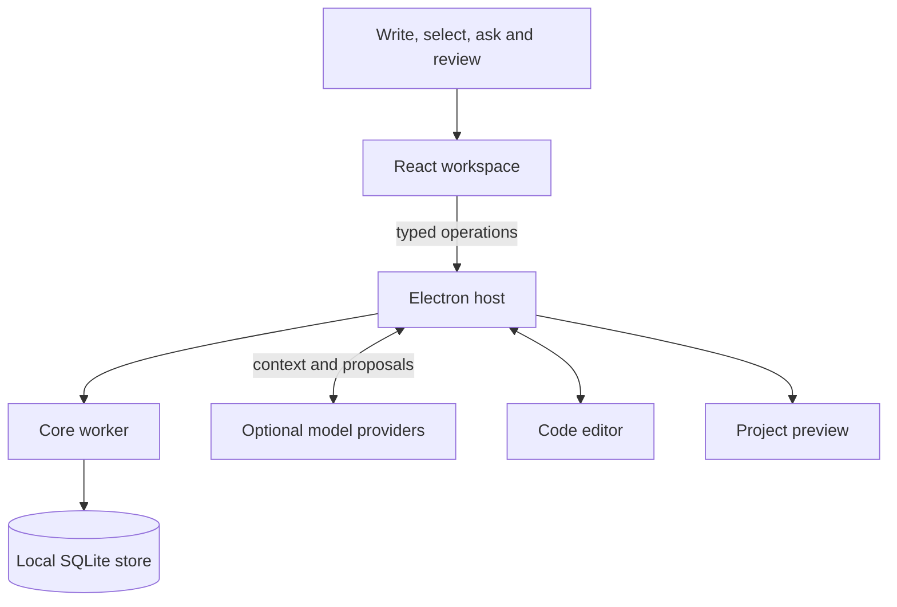

# How Eve works

Eve brings a workspace, local persistence and isolated activities into one desktop. The interface can change around the work while the person's writing, material and editing session stay in place.

## From an intention to a workspace

Eve captures the current space, relevant material and selected passage. An AI provider can propose a composition of registered tools or a change to existing work. These proposals are structured data checked against Eve's contracts, available resources and current revisions.

The person reviews changes before applying them. Direct edits remain immediate, with visible saving and error states. The core worker owns all durable SQLite writes so model responses and interface updates cannot bypass the persistence rules.

## Continuity across activities

Code editors and project previews run in separate views owned by the Electron host. Returning Home or opening another space preserves the active editor's unsaved buffers and editing history. Imported material retains its original bytes, while reversible adjustments are stored separately.

Provider credentials stay outside the React interface. Each request has bounded context, and a stale proposal is rejected if the work has changed since it was prepared.

## Explore the source

| Component | Responsibility |
| --- | --- |
| [Desktop](../apps/desktop/) | Host, isolated views and workspace interface |
| [Core](../packages/core/) | Local persistence, revisions and recovery |
| [Contracts](../packages/contracts/) | Validated documents and operations |
| [Agent](../packages/agent/) | Context, provider adapters and proposals |
| [Workbench](../extensions/eve-workbench/) | Editor context, reviewed edits and continuity |
| [Orbit](../examples/orbit/) | The editable study-timer example |

Eve remains a prototype. Native interaction coverage and live model quality vary by capability; optional voice, video and Linux-session work is still experimental.
